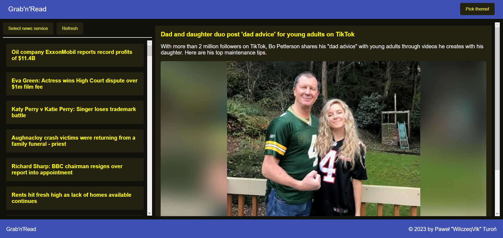
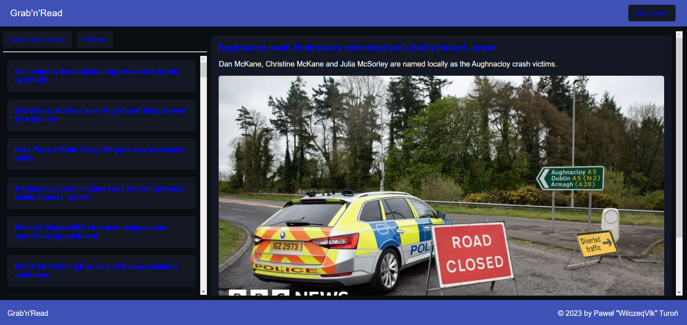
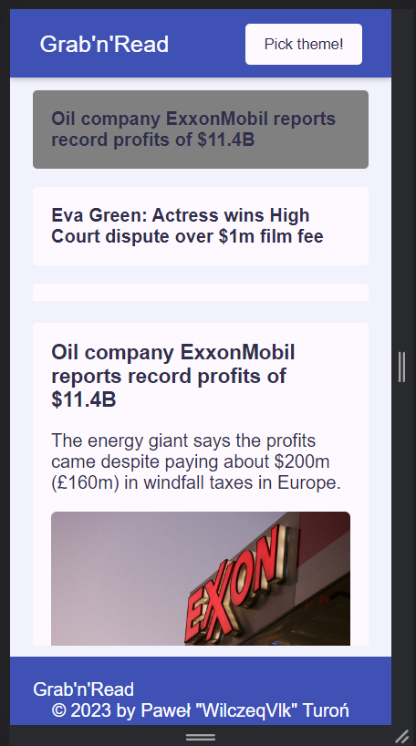

# Grab'n'Read

## What's new?

There's no new features at the moment.

## About project

This project aims to practice Angular and improve my programming skills. I used newsapi.org for fetching news from different platforms like bbc.com or cnn.com. I created application ONLY for educational purposes.

Screenshots below

Web-screen 1

Web-screen 2

Mobile

## Technologies used in the project

- Angular CLI v15
- Angular Material

## Goals

Like I mentioned before, this project was created to have fun and practice Angular ovreall. Maybe my app will be inspiration to some people.

## License

My project is under Apache 2.0 license. You can use some parts from my code but remember to credit me as an appreciation to my work! Thanks! Awoo!

© 2023 Paweł "Wilczeq/Vlk" Turoń

